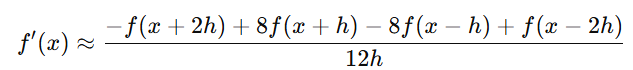
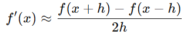
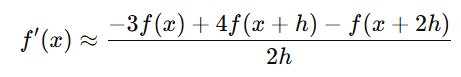
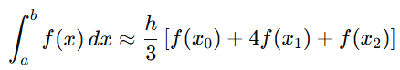
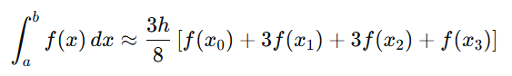

# Tema 4
    Diferenciación e integración numérica

## Competencia del tema
    Utiliza los métodos numéricos para diferenciación e  integración numérica aplicando los métodos clásicos. 

## Actividades
- [T4 - E1 - Mapa Conceptual](/Tema%204/Evidencia%201/)
- [T4 - E2 - Problemario](/Tema%204/Evidencia%202/)
- [T4 - E3 - Programa / Evaluación](/Tema%204/Evidencia%203/)

# Apuntes

## Método de los Cinco Puntos

### ✅ ¿Para qué sirve?

- Aproximar derivadas de funciones usando 5 puntos equidistantes.
- Se usa sobre todo para derivadas de mayor precisión, porque toma más puntos alrededor del que se evalúa.

### 🧮 Fórmula típica (para primera derivada centrada):

### 💡 Características:
- Mayor exactitud que métodos de 3 puntos.
- Más costoso computacionalmente.
- Necesita valores en dos puntos hacia adelante y hacia atrás.

## Método de los Tres Puntos

### ✅ ¿Para qué sirve?
- También para aproximar derivadas, pero usando solo 3 puntos.
- Hay distintas fórmulas: centrada, hacia adelante y hacia atrás.

### 🧮 Fórmulas típicas:
- Derivada centrada (mayor precisión):

- Hacia adelante:

### 💡 Características:
- Más simple.
- Menos precisa que la de cinco puntos.
- Ideal cuando no tienes muchos valores disponibles.

## Método de Simpson

### ✅ ¿Para qué sirve?
- Aproximar integrales definidas.
- Es una mezcla entre el método del trapecio y una parábola.
- Hay dos variantes: Simpson 1/3 y Simpson 3/8.

### 🧮 Fórmulas:
- Simpson 1/3 (usa 3 puntos, 2 subintervalos):

- Simpson 3/8 (usa 4 puntos, 3 subintervalos):

### 💡 Características:
- Muy preciso para funciones suaves.
- Necesita que el número de subintervalos sea par (en 1/3) o múltiplo de 3 (en 3/8).
- Se basa en interpolación cuadrática (1/3) o cúbica (3/8).

