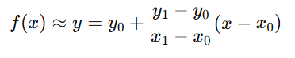

# Tema 5
    Interpolación y ajuste de funciones

## Competencia del tema
    Aplica los métodos numéricos con el objetivo aproximar y ajustar funciones mediante el método los métodos de interpolación y regresión clásicos.

## Actividades
- [T5 - E3 - Programa ](/Tema%205/Evidencia3/)
- [T5 - E2 - Problemario](./Evidencia%202/)
- [T5 - E3 - Programa](./Evidencia%203/)

# Apuntes

## 📌 ¿Qué es la interpolación lineal?

    Es una técnica de aproximación que permite estimar el valor de una función f(x) entre dos puntos conocidos (x0, y0) y (x1, y1), asumiendo que el comportamiento de la función entre ellos es lineal.

### 📐 Fórmula general
La fórmula de interpolación lineal es:

Dondes: 
- (x0, y0) y (x1, y1) son los puntos conocidos. 
- x es el valor intermedio entre x0 y x1.
- y es el valor estimado de la función en x.

### 🧠 Pasos para aplicar la interpolación lineal
1. Identificar los puntos conocidos (x0, y0) y (x1, y1)
2. Verificar que x esté entre x0 y x1.
3. Sustituir los valores en la fórmula de interpolación lineal.
4. Calcular el valor aproximado de y.

### 📝 Ventajas
- Método simple y rápido.
- Buena aproximación si los puntos están cercanos y la función es suave.

### ⚠️ Desventajas
- No es exacto si la función no es lineal en el intervalo.
- Puede generar errores significativos si se aplica fuera del intervalo (extrapolación).

### 📚 Aplicaciones comunes
- Ingeniería y física para obtener datos faltantes.
- Tablas de valores (como logaritmos, funciones trigonométricas).
- Gráficas y simulaciones numéricas.