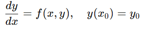
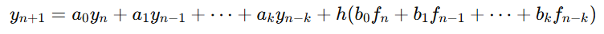
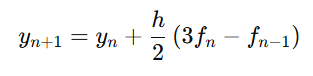
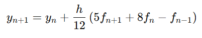

# Tema 6
    Solución de ecuaciones diferenciales

## Competencia del tema
    Utiliza los métodos de transformación numérica para solución de ecuaciones diferenciales, valiéndose de los métodos clásicos  y caracteriza sus aplicaciones y limitaciones.

## Actividades
- [T6 - E1 - Exposición](./Evidencia%201/)
- [T6 - E2 - Problemario]()

# Apuntes

## Métodos de Varios Pasos

### 📌 ¿Qué son?

    Los métodos de varios pasos (o multistep methods) son técnicas numéricas que utilizan más de un punto anterior para aproximar la solución de una ecuación diferencial ordinaria (EDO).
    Se diferencian de los métodos de un solo paso (como Euler o Runge-Kutta) porque aprovechan información previa para mejorar la precisión sin aumentar el número de evaluaciones de la función en cada paso.

### 📐 Forma general
Para una EDO de la forma:

El método de varios pasos tiene una forma general:

Donde:

- y_(n+1) es el valor aproximado de la solución en el paso siguiente.
- fi = f(xi, yi)
- h es el tamaño del paso.
- los coeficientes ai, bi definen el método.

### 🔢 Métodos comunes

#### ✅ Método de Adams-Bashforth (explícito)
- Usa solo valores ya conocidos.
- Fórmula (2 pasos):

#### ✅ Método de Adams-Moulton (implícito)
- Involucra el valor f_(n+1), requiere resolver una ecuación.
- Fórmula (2 pasos):

### 🧠 Ventajas
- Mayor eficiencia: reutilizan información previa, reduciendo evaluaciones.
- Alta precisión con pasos más grandes en comparación con métodos de un solo paso.

### ⚠️ Desventajas
- Requieren de valores iniciales previos (usualmente obtenidos con Runge-Kutta).
- Los métodos implícitos pueden ser computacionalmente costosos.

### 📚 Aplicaciones típicas
- Modelado de sistemas físicos (movimiento, circuitos, reacciones químicas).
- Simulación de procesos en tiempo real donde se busca precisión acumulada.